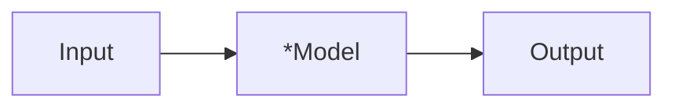
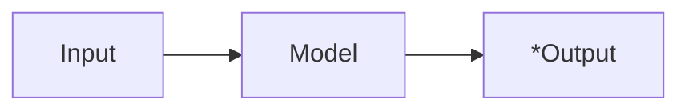

# 基于 Infer.net 的概率编程实践

AI方向有几大经典问题：

- 分类
- 聚类
- 回归
- 推荐
- 特征检测

许多复杂问题，都可以通过简化成经典问题，适用最基本的算法解决。比如:

- 计算机视觉
- 自然语言处理
- 语音识别
- 有监督和无监督学习
- 强化学习

在解决复杂问题上，存在着多种学派，它们分别有一些代表算法：
| 派别     | 起源         | 代表算法         |
| -------- | ------------ | ---------------- |
| 符号主义 | 逻辑学、哲学 | 演绎算法         |
| 联结主义 | 神经科学     | 反向传播算法(BP) |
| 进化主义 | 生物学       | 遗传算法         |
| 贝叶斯派 | 统计学       | 概率推理         |

每个学派，都不是通往AI的唯一路径，概率编程也不是。深度学习已经在自动驾驶、破解围棋等方面取得了突破进展，但其缺点是需要大量的标注数据，训练速度慢，且不具备可理解性。而概率编程，可以很方便的针对某个具体问题，定义一个概率模型，然后运用Infer.net去求解这个模型。得到模型之后，就能应用在新的数据上。

为了展开今天的题目，我们需要先温习一下**概率论**的知识，然后介绍**Infer.net**的工作原理，最后我们看几个例子，了解概率编程是如何实践的。最后，也是最让人兴奋的环节，我们来脑暴一下概率编程有哪些可供落地的**应用场景**。

## 朴素贝叶斯公式

这里先解释什么是条件概率：
 "P(A|B)")

表示事件B已经发生的前提下，事件A发生的概率，叫做事件B发生下事件A的条件概率。其基本求解公式为：=\frac{P(AB)}{P(B)} "P(A|B)=\frac{P(AB)}{P(B)}")。

贝叶斯定理之所以有用，是因为我们在生活中经常遇到这种情况：我们可以很容易直接得出P(A|B)，P(B|A)则很难直接得出，但我们更关心P(B|A)，贝叶斯定理就为我们打通从P(A|B)获得P(B|A)的道路。

下面不加证明地直接给出贝叶斯定理：

=\frac{P(A|B)P(B)}{P(A)} "P(B|A)=\frac{P(A|B)P(B)}{P(A)}")

为了很好的说明这个问题，在这里举一个例子：

> 玩英雄联盟占到中国总人口的60%，不玩英雄联盟的人数占到40%：
>
> 为了便于数学叙述，这里我们用变量X来表示取值情况，根据概率的定义以及加法原则，我们可以写出如下表达式：
>
> P(X=玩lol)=0.6；P(X=不玩lol)=0.4。

这个概率是统计得到的，即X的概率分布已知，我们称其为**先验概率(prior probability)**；

> 另外玩lol中80%是男性，20%是小姐姐,不玩lol中20%是男性，80%是小姐姐,这里我用离散变量Y表示性别取值，同时写出相应的条件概率分布：
>
> P(Y=男性|X=玩lol)=0.8，P(Y=小姐姐|X=玩lol)=0.2
> 
> P(Y=男性|X=不玩lol)=0.2，P(Y=小姐姐|X=不玩lol)=0.8

那么我想问在已知玩家为男性的情况下，他是lol玩家的概率是多少：

依据贝叶斯准则可得：

P(X=玩lol|Y=男性)=P(Y=男性|X=玩lol)\*P(X=玩lol)/

\[ P(Y=男性|X=玩lol)\*P(X=玩lol)+P(Y=男性|X=不玩lol)\*P(X=不玩lol)\]

最后算出的P(X=玩lol|Y=男性)称之为X的**后验概率**，即它获得是在观察到事件Y发生后得到的

## 常见的分布形式

- 伯努利分布

- 正态分布

- Gamma分布
- Beta分布
- Dirichlet分布

## 概率编程的思想

计算机是被设计成处理

## 对Infer.net的简单归纳

对于各路机器学习算法来说，解决问题无非分两大步：求解模型和应用模型。对scikit-learn、ml.net这类框架来说，是用输入训练数据来fit预先选定的模型，然后通过测试集来检验模型的性能。而对Infer.net来说，首先你要基于贝叶斯网络定义你的数学模型，然后运用框架来协助你推理得到模型中的不确定因素，模型才算训练完成，而后可以应用到测试集上面。

也就是说，Infer.net做的事情，可以通过以下不同的方式表达，但其实都是一个意思：

- 给定先验概率(观测数据)和所需常数，用来推理后验概率
- 定义一套数学过程，用来求解其中的变量
- 用来求解方程，只不过方程中的变量一般都是概率分布

### 求解模型

定义好模型之后，Model中存在可变量，Input和Output都是定量，根据上图可利用Infer.net求解出Model中的可变量，也就得到了训练好的Model。

### 应用模型：

模型确定之后，给定新的Input，根据上图可利用Infer.net求解可变量Output。

### 一段中英翻译

### 一段背景：微软研究院

微软研究院是盖茨在1991年创立的研究机构，其中一个固定的目标为“支持长期的计算机科学硏究而不受产品周期所限”。

微软研究院的研究范畴可以被归类为10大项：

1. [算法](https://zh.wikipedia.org/wiki/%E6%BC%94%E7%AE%97%E6%B3%95 "算法")与理论
2. 硬件发展
3. [人机交互](https://zh.wikipedia.org/wiki/%E4%BA%BA%E6%A9%9F%E4%BA%92%E5%8B%95 "人机交互")
4. 机械的学习、适应与智能
5. [多媒体](https://zh.wikipedia.org/wiki/%E5%A4%9A%E5%AA%92%E9%AB%94 "多媒体")与视频技术
6. 数据搜索、截取与[知识管理](https://zh.wikipedia.org/wiki/%E7%9F%A5%E8%AD%98%E7%AE%A1%E7%90%86 "知识管理")
7. 信息安全与加密技术
8. 社会计算
9. 软件发展
10. 系统、[计算机体系结构](https://zh.wikipedia.org/wiki/%E8%AE%A1%E7%AE%97%E6%9C%BA%E4%BD%93%E7%B3%BB%E7%BB%93%E6%9E%84 "计算机体系结构")、可携系统与网上

今天所讲述的Infer.net，即诞生于微软剑桥研究院。除此之外，在微软亚洲研究院还诞生了我们熟知的Xbox Kinect、微软小冰和小娜、Skype中文翻译等。二十年来，从微软亚洲研究院走出了李开复（创新工场）、张亚勤（百度总裁）、王坚（阿里云）、林斌（小米合伙人）、张宏江（金山CEO）、赵峰（海尔CTO）、芮勇（联想CTO）、汤晓鸥（商汤科技）。整部中国互联网的兴衰史，都有微软的痕迹在。

sandy跟我两个人学习的AI课题，在MSRA从事这个方向的，有二十来个组：

- 系统组
- 网络多媒体组
- 创新工程组
- 理论组
- 知识挖掘组
- 视觉计算组
- 语音组
- 自然语言计算组
- 多媒体计算组
- 软件分析组
- 数据挖掘与企业智能化组
- 多媒体搜索与挖掘组
- 网络图形组
- 城市计算组
- 机器学习组
- 云计算及移动计算组
- 社会计算组
- 大数据挖掘组

不同于鹅厂曾经设立的研究院，微软的研究院致力于将最新的科研成果转化为商业产品，和进行纯粹的学术研究，而不是与业务部门抢占用户份额。所以不管微软这些年有多么饱受批评，我都很尊敬这家公司，这是能推动人类文明向前迈进的真正伟大的科技公司。微软的技术、苹果的专制、谷歌的开放，都是我认为这个行业十分迷人的地方，从这些公司诞生的技术，也一直照耀着我们每个从业人员、成为支撑着我们进行日常工作和学习的动力吧。

