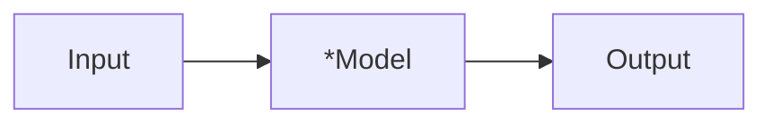
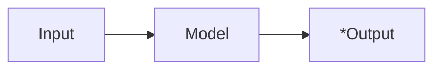

# 基于 Infer.net 的概率编程实践


AI方向有几大经典问题：

- 分类
- 聚类
- 回归
- 推荐
- 特征检测

许多复杂问题，都可以通过简化成经典问题，适用最基本的算法解决。比如:

- 计算机视觉
- 自然语言处理
- 语音识别
- 有监督和无监督学习
- 强化学习

在解决复杂问题上，存在着多种学派，它们分别有一些代表算法：

| 派别     | 起源         | 代表算法         |
| -------- | ------------ | ---------------- |
| 符号主义 | 逻辑学、哲学 | 演绎算法         |
| 联结主义 | 神经科学     | 反向传播算法(BP) |
| 进化主义 | 生物学       | 遗传算法         |
| 贝叶斯派 | 统计学       | 概率推理         |

每个学派，都不是通往AI的唯一路径，概率编程也不是。深度学习已经在自动驾驶、破解围棋等方面取得了突破进展，但其缺点是需要大量的标注数据，训练速度慢，且不具备可理解性。而概率编程，可以很方便的针对某个具体问题，定义一个概率模型，然后运用Infer.net去求解这个模型。得到模型之后，就能应用在新的数据上。

为了展开今天的题目，我们需要先温习一下**概率论**的知识，然后介绍**Infer.net**的工作原理，最后我们看几个例子，了解概率编程是如何实践的。最后，也是最让人兴奋的环节，我们来脑暴一下概率编程有哪些可供落地的**应用场景**。

## 0x01 朴素贝叶斯公式

这里先解释什么是条件概率：
 "P(A|B)")

表示事件B已经发生的前提下，事件A发生的概率，叫做事件B发生下事件A的条件概率。其基本求解公式为：=\frac{P(AB)}{P(B)} "P(A|B)=\frac{P(AB)}{P(B)}")。

贝叶斯定理之所以有用，是因为我们在生活中经常遇到这种情况：我们可以很容易直接得出P(A|B)，P(B|A)则很难直接得出，但我们更关心P(B|A)，贝叶斯定理就为我们打通从P(A|B)获得P(B|A)的道路。

下面不加证明地直接给出贝叶斯定理：

=\frac{P(A|B)P(B)}{P(A)} "P(B|A)=\frac{P(A|B)P(B)}{P(A)}")

为了很好的说明这个问题，在这里举一个例子：

> 玩英雄联盟占到中国总人口的60%，不玩英雄联盟的人数占到40%：
>
> 为了便于数学叙述，这里我们用变量X来表示取值情况，根据概率的定义以及加法原则，我们可以写出如下表达式：
>
> P(X=玩lol)=0.6；P(X=不玩lol)=0.4。

这个概率是统计得到的，即X的概率分布已知，我们称其为**先验概率(prior probability)**；

> 另外玩lol中80%是男性，20%是小姐姐,不玩lol中20%是男性，80%是小姐姐,这里我用离散变量Y表示性别取值，同时写出相应的条件概率分布：
>
> P(Y=男性|X=玩lol)=0.8，P(Y=小姐姐|X=玩lol)=0.2
> 
> P(Y=男性|X=不玩lol)=0.2，P(Y=小姐姐|X=不玩lol)=0.8

那么我想问在已知玩家为男性的情况下，他是lol玩家的概率是多少：

依据贝叶斯准则可得：

P(X=玩lol|Y=男性)=P(Y=男性|X=玩lol)\*P(X=玩lol)/

\[ P(Y=男性|X=玩lol)\*P(X=玩lol)+P(Y=男性|X=不玩lol)\*P(X=不玩lol)\]

最后算出的P(X=玩lol|Y=男性)称之为X的**后验概率**，即它获得是在观察到事件Y发生后得到的

## 0x02 常见的分布形式

- 伯努利分布


- 正态分布

在自然界中广泛存在的分布形式，男人和女人的身高和体重、考试成绩、球员发挥，都符合正态分布。


- Gamma分布
- Beta分布
- Dirichlet分布

## 0x03 概率编程的思想

计算机的行为是完全符合因果逻辑的，而现实世界是量子的，充满各种可能性，只有在你进行观察的时候才会输出特定结果（薛定谔的猫），**没办法用C++里的bool、int、class进行模拟**。

拿手写识别来说，用户手写的hill，在计算机看来是hill还是bull呢？甚至是train也有可能，但显然它是hill相比它是helicopter要靠谱多了。那么怎么用编程语言来表达这种不确定性呢？我们假定是random_var，这个random_var代表可能识别出的几个单词，但不能确定到底是哪个。

random_var的含义，可以是一组字符串，它会关联一种概率分布。这就代表了计算机对这种可能性的理解，也就达成了用概率模型描述现实世界的目的。

那么如何获知，它是hill还是bull的概率呢？

- 站在用户的角度看，这是一个因果模型
- 运用概率编程的思想，可以构建一个模型，将用户想输入的文本转换成手写图形，根据每个用户的习惯不同，手写图形的风格也会不同

那么反过来，我们如何根据这个图形，来获知它所代表的文本呢？概率编程，就是应用贝叶斯推理的方法，根据先验概率和部分常数，来得到hill和bull的后验概率。用这种思想，来完成手写识别的操作。

## 0x04 对Infer.net的简单归纳

对于各路机器学习算法来说，解决问题无非分两大步：求解模型和应用模型。对scikit-learn、ml.net这类框架来说，是用输入训练数据来fit预先选定的模型，然后通过测试集来检验模型的性能。而对Infer.net来说，首先你要基于贝叶斯网络定义你的数学模型，然后运用框架来协助你推理得到模型中的不确定因素，模型才算训练完成，而后可以应用到测试集上面。

也就是说，Infer.net做的事情，可以通过以下不同的方式表达，但其实都是一个意思：

- 给定先验概率(观测数据)和所需常数，用来推理后验概率
- 定义一套数学过程，用来求解其中的变量
- 用来求解方程，只不过方程中的变量一般都是概率分布
- 用概率分布代表事件或属性，只有在观察或推理时，事件或属性才有确定的值

### 求解模型



(带星号的，表示未知量)

定义好模型之后，Model中存在可变量，Input和Output都是定量，根据上图可利用Infer.net求解出Model中的可变量，也就得到了训练好的Model。

### 应用模型：



在应用模型时，模型已经是已知的，而Output变成未知的。给定新的Input，根据上图可利用Infer.net求解可变量Output。

## 0x05 一些例子

在本项目中，根据我自己的学习进度，会逐渐增加一些例子，有些来自微软，有些是原创。我按自己的理解，通过学习这些例程，可以逐渐增加对概率编程的理解，帮助我们更好地用infer.net来对概率编程进行实践。

### 抛硬币

我们连续抛两次硬币，假设硬币质量均匀，求这两次都是正面朝上的概率。

```csharp
Variable<bool> firstCoin = Variable.Bernoulli(0.5);
Variable<bool> secondCoin = Variable.Bernoulli(0.5);
Variable<bool> bothHeads = firstCoin & secondCoin;
InferenceEngine engine = new InferenceEngine();
Console.WriteLine("Probability both coins are heads: " + engine.Infer(bothHeads));

// 输出：
// Probability both coins are heads: Bernoulli(0.25)
```

如同前面所说，概率编程中，需要为现实问题定义一个模型。抛硬币的模型里，包含两个事件：第一次是正面和第二次是正面。它们都服从伯努利分布，我们从infer.net中新建两个伯努利分布，来代表这两个事件发生。我们要计算的后验概率，即第一次和第二次都是正面，可以定义为`bothHeads = firstCoin & secondCoin`。

在这个模型中，firstCoin和secondCoin都是已知其先验概率（硬币质量均匀，正面概率0.5）的伯努利分布，我们用infer.net来推理bothHeads的后验概率。输出结果是Bernoulli(0.25)，也就是说infer.net计算出来的这枚硬币第一次和第二次都是正面的概率，是0.25。

这个例子只是为了演示概率编程中的符号含义，现在我们做一个小小的调整。我们假定**第一次已经抛出正面**，让infer.net来计算最终的bothHeads，看它是否能正确的得出调整后的结果，也就是0.5。

我们在进行推理（调用engine.Infer(...)函数）之前，插入这样一行：

```csharp
firstCoin.ObservedValue = true;

// 调整后的输出
// Probability both coins are heads: Bernoulli(0.5)
```

可以观察到，infer.net很“聪明”地得到了正确的结果。这里值得注意一点，为什么我们不给firstCoin本身赋值、而是要给`firstCoin.ObservedValue`赋值呢？可以动手试试看：

```csharp
firstCoin = true;

// 调整后的输出
// Probability both coins are heads: Bernoulli(0.25)
```

因为我们构建的模型中，最终事件bothHeads仍然是由firstCoin和secondCoin两个事件同时发生定义的。在这个模型中，firstCoin有可能触发了（正面）、也有可能没触发（反面），只有在进行infer的时候，才会约束它处于已触发的状态（正面）。我们上面提到，不能用高级语言里的bool、int来为现实世界建模，就是因为现实世界的模型里每个事件都是未知的，它都要服从一个概率分布，而不是直接将其定义为true或者false，只有在这个模型运行起来、或是进行观察的时候，这个事件才会具有确定的值。这就是把`Variable<bool>`和`bool`区分开来的地方：如果你要假定firstCoin事件已经发生，那么把它的**观测值**，即`ObservedValue`进行赋值即可。

如果你联想起来了“薛定谔的猫”实验，那么就说明你已经理解概率编程的思想了，我们继续。

### 解方程

为了说明“infer.net做的事情就是求解模型中的未知量”，我们来看一个解方程的例子。我们都记得圆周长的公式：C = 2πr。我们假设一个圆的周长是4π，用infer.net来求它的半径。

```csharp
Variable<double> r = Variable.Random(new Gaussian(1, 1)).Named("radius");
Variable<double> len = ((Variable<double>)4 * Math.PI).Named("length");
Variable<double> currlen = ((Variable<double>)2 * r * Math.PI).Named("curr length");
Variable.ConstrainEqual(currlen, len);
InferenceEngine engine = new InferenceEngine();
engine.ShowFactorGraph = true;
Console.WriteLine($"r = {engine.Infer(r)}");

// 输出
// r = Gaussian.PointMass(2)
```


运行程序，我们不仅得到了r = 2的结果，还得到了一张流程图。在设置推理引擎的ShowFactorGraph字段为true之后，infer.net就会自动将概率模型，用流程图的形式打印出来。而且流程图上明确的标注了radius、current length和length，这是因为我们使用了`.Named("radius")`这种LINQ语法。这是C#语言的一颗语法糖，它允许你在定义变量的时候直接指定它的名字，而不需要再另起一行，再编写`r.Name = "radius";`。

infer.net中可以对变量进行约束，就是指`Variable.ConstrainEqual(currlen, len);`这一行，它保证两个变量在该模型中无论怎样波动，其观测值都是相等的。类似的，还有`Variable.ConstrainTrue`、`Variable.ConstrainBetween`、`Variable.ConstrainRandom`等其它约束条件。我们的整个模型（方程），可以认为就是由这一行定义出来的。

我们虽然将半径表达成高斯分布的形式，但得到的结果却是一个质点。是因为在这个模型里，infer.net正确地推断出了半径的概率分布只集中在x=2上。我们再次演示了，infer.net做的事情，就是求解模型中的不确定量。这个模型，就可以当成方程来理解。**只要你能把现实问题用方程的形式列出来，那么infer.net就能帮你求解这个问题。**

### 贝叶斯点机

前面两个例子只是个hello world，现在看一个稍微现实一点的例程。我们试着实现一个贝叶斯点机 - [Bayes Point Machine](http://jmlr.org/papers/v1/herbrich01a.html) (R. Herbrich, T. Graepel, and C. Campbell, **Bayes Point Machines**, JMLR, 2001) ，用来根据顾客的收入和年龄，预测他是否会购买我们的商品。我们手里拿着训练集和测试集，先对模型进行求解，然后进行应用。

```csharp
// 训练集
double[] incomes = { 63, 16, 28, 55, 22, 20 };  
double[] ages = { 38, 23, 40, 27, 18, 40 };  
bool[] willBuy = { true, false, true, true, false, false };

// 符号表示
Vector[] xdata = new  Vector[incomes.Length];  
for (int i = 0; i < xdata.Length; i++)  
  xdata[i] = Vector.FromArray(incomes[i], ages[i], 1);  
VariableArray<Vector> x = Variable.Observed(xdata);  

VariableArray<bool> y = Variable.Observed(willBuy, x.Range);
```

贝叶斯点机（Bayes Point Machine）进行二元分类的原理如下：

- 用向量x代表输入样本、向量w代表模型中的权重向量，计算两个向量的内积 w*x
- 如果w*x为正，则预测结果为true，如果为负，则预测结果为false

根据训练集构建一个贝叶斯点机的本质，实际上就是用infer.net来学习权重向量w的后验分布。在这个预测顾客是否购买的问题里，样本并不是线性分布的，为了防止w对样本过拟合，所以需要把w*x表示为高斯分布的形式，加入一些噪声。因为实际上，购买行为并不是确定的，而是会受其他因素影响的，这种行为符合高斯分布。在模型中加入少量噪声方差即可。所以购买问题里的模型，是这样定义的：

```csharp
// 模型构建
Variable<Vector> w = Variable.Random(new VectorGaussian(Vector.Zero(3), PositiveDefiniteMatrix.Identity(3)));  
Range j = y.Range;  
double noise = 0.1;
y[j] = Variable.GaussianFromMeanAndVariance(Variable.InnerProduct(w, x[j]),noise)>0;

// 求解模型：推理w
InferenceEngine engine = new InferenceEngine(new ExpectationPropagation());  
VectorGaussian wPosterior = engine.Infer<VectorGaussian>(w);  
Console.WriteLine("Dist over w=\n"+wPosterior);
```

在应用模型时，也就是在编码的过程中，会发现“将训练集和测试集放到模型中”的逻辑是重复的，所以可以将其抽成一个函数。然后给出一些测试集的分类效果：

```csharp
// "Fit" data into model
public void BayesPointMachine (double[] incomes, double[] ages, Variable<Vector> w, VariableArray<bool> y)
{ // Create x vector, augmented by 1
  Range j = y.Range; Vector[] xdata = new Vector[incomes.Length];
  for (int i = 0; i < xdata.Length; i++)  
    xdata[i] = Vector.FromArray(incomes[i], ages[i], 1);
  VariableArray<Vector> x = Variable.Observed(xdata,j); // Bayes Point Machine double noise = 0.1;  
  y[j] = Variable.GaussianFromMeanAndVariance(Variable.InnerProduct(w, x[j]),noise)>0; 
}

// 应用模型
double[] incomesTest = { 58, 18, 22 };  
double[] agesTest = { 36, 24, 37 };  
VariableArray<bool> ytest = Variable.Array<bool>(new Range(agesTest.Length));  
BayesPointMachine(incomesTest, agesTest, Variable.Random(wPosterior), ytest);  
Console.WriteLine("output=\n" + engine.Infer(ytest));

// 输出
classifier output=  
[0] Bernoulli(0.9555)  
[1] Bernoulli(0.1565)  
[2] Bernoulli(0.287)
```

### 球队排名

为现实世界建立概率模型，还有一个重要意义就是可以加深对现实世界本身的理解。事实上，infer.net在微软产品中一个重要应用，就是**HALO5（光环5）**的战局匹配系统。而且MSDN上也是用了下面这个例子来演示infer.net的强大，我最开始也是看的这个例程，当时被`bool`和`Variable<bool>`搞得一脸懵逼 23333。

为了让这个例子变得有趣一点，我把例程中的`Player0..4`映射成了足球队名，然后把2018年世界杯淘汰赛的胜负数据给输到里面，让我们来看看谁强谁弱。


### 在线学习：在不断有新数据到来的情况下，对模型进行求解

### MotifFinder：概率编程在生物学领域的应用

## 一段背景：微软研究院

微软研究院是盖茨在1991年创立的研究机构，其中一个固定的目标为“支持长期的计算机科学硏究而不受产品周期所限”。

微软研究院的研究范畴可以被归类为10大项：

1. [算法](https://zh.wikipedia.org/wiki/%E6%BC%94%E7%AE%97%E6%B3%95 "算法")与理论
2. 硬件发展
3. [人机交互](https://zh.wikipedia.org/wiki/%E4%BA%BA%E6%A9%9F%E4%BA%92%E5%8B%95 "人机交互")
4. 机械的学习、适应与智能
5. [多媒体](https://zh.wikipedia.org/wiki/%E5%A4%9A%E5%AA%92%E9%AB%94 "多媒体")与视频技术
6. 数据搜索、截取与[知识管理](https://zh.wikipedia.org/wiki/%E7%9F%A5%E8%AD%98%E7%AE%A1%E7%90%86 "知识管理")
7. 信息安全与加密技术
8. 社会计算
9. 软件发展
10. 系统、[计算机体系结构](https://zh.wikipedia.org/wiki/%E8%AE%A1%E7%AE%97%E6%9C%BA%E4%BD%93%E7%B3%BB%E7%BB%93%E6%9E%84 "计算机体系结构")、可携系统与网上

**今天所讲述的Infer.net，即诞生于微软剑桥研究院。** 除此之外，在微软亚洲研究院还诞生了我们熟知的Xbox Kinect、微软小冰和小娜、Skype中文翻译等。二十年来，从微软亚洲研究院走出了李开复（创新工场）、张亚勤（百度总裁）、王坚（阿里云）、林斌（小米合伙人）、张宏江（金山CEO）、赵峰（海尔CTO）、芮勇（联想CTO）、汤晓鸥（商汤科技）。整部中国互联网的兴衰史，都有微软的痕迹在。

sandy跟我两个人学习的AI课题，在MSRA从事这个方向的，有二十来个组：

- 系统组
- 网络多媒体组
- 创新工程组
- 理论组
- 知识挖掘组
- 视觉计算组
- 语音组
- 自然语言计算组
- 多媒体计算组
- 软件分析组
- 数据挖掘与企业智能化组
- 多媒体搜索与挖掘组
- 网络图形组
- 城市计算组
- 机器学习组
- 云计算及移动计算组
- 社会计算组
- 大数据挖掘组

不同于鹅厂曾经设立的研究院，微软的研究院致力于将最新的科研成果转化为商业产品，和进行纯粹的学术研究，而不是与业务部门抢占用户份额。所以不管微软这些年有多么饱受批评，我都很尊敬这家公司，这是能推动人类文明向前迈进的真正伟大的科技公司。微软的技术、苹果的专制、谷歌的开放，都是我认为这个行业十分迷人的地方，从这些公司诞生的技术，也一直照耀着我们每个从业人员、成为支撑着我们进行日常工作和学习的动力吧。

